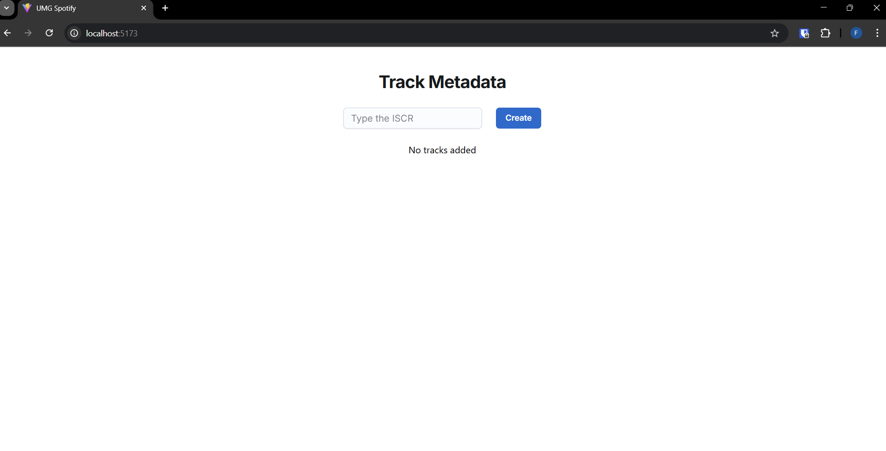
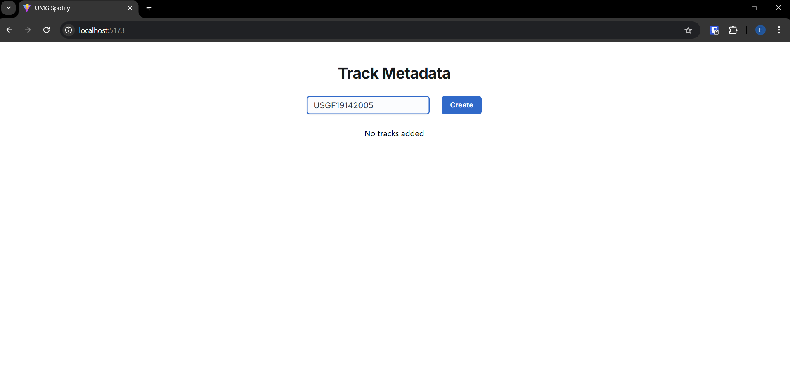
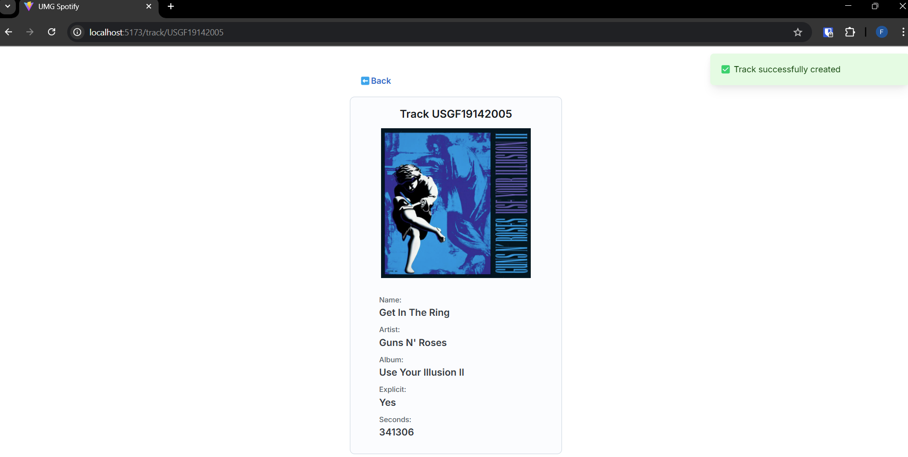
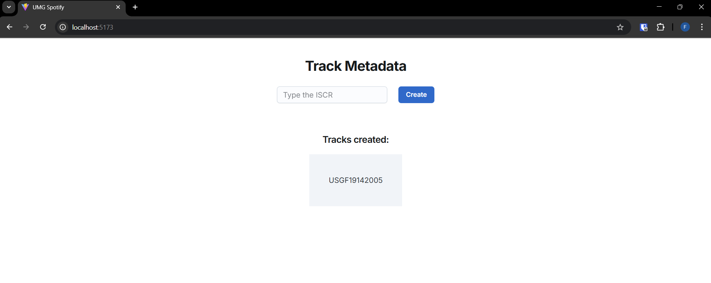
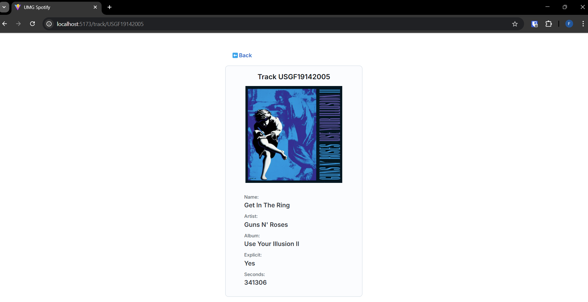
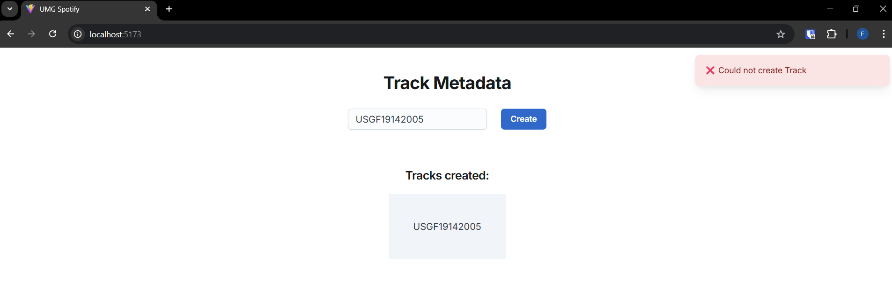

# UMG FRONTEND APP

Application that interacts with the [REST API](https://github.com/flaviobarbosa/umg-backend) for requesting metadata of a music track from an external service storing it in a
database.

## Run Locally

Clone the project

```bash
  git clone https://github.com/flaviobarbosa/umg-frontend
```

Go to the project directory

```bash
  cd umg-frontend
```

Build docker image

```bash
docker build -t umg-frontend .
```

Start the application

```bash
docker run -p 5173:5173 umg-frontend
```

## Screenshots

#### Inicial Screen



#### Create Metadata





#### Initial Screen with created Metadata



#### Track Metadata



#### Trying to add an created metadata


